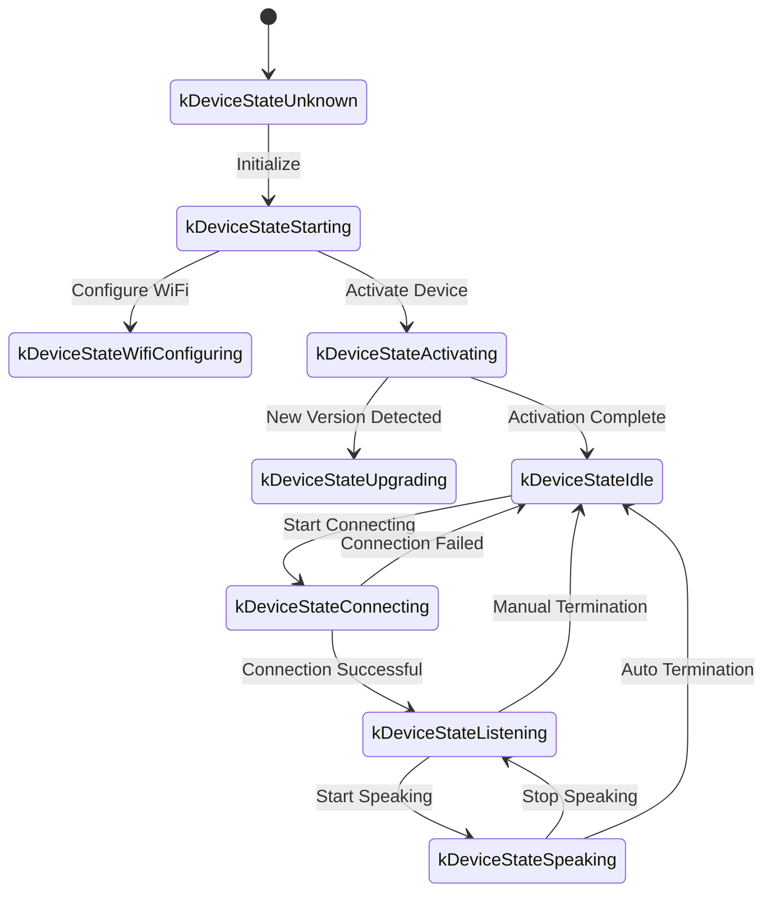
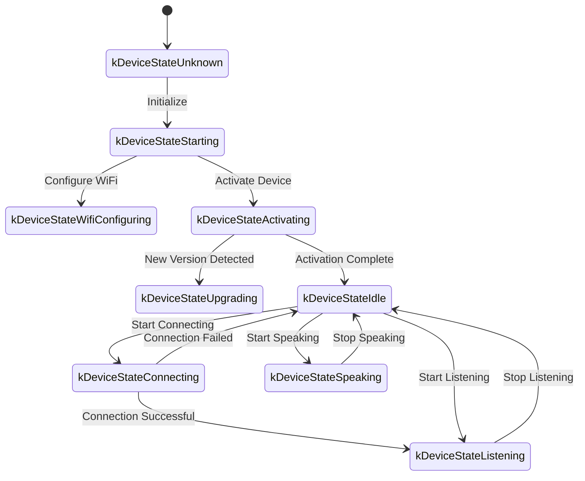

The following is a WebSocket communication protocol document organized based on code implementation, outlining how the device and server interact via WebSocket.

This document is inferred solely from the provided code. Actual deployment may require further confirmation or supplementation based on the server-side implementation.

---

## 1. Overall Flow Overview

1. **Device Initialization**
   - Device powers on, initializes `Application`:
     - Initializes audio codec, display, LEDs, etc.
     - Connects to network
     - Creates and initializes the WebSocket protocol instance (`WebsocketProtocol`) implementing the `Protocol` interface
   - Enters main loop waiting for events (audio input, audio output, scheduled tasks, etc.).

2. **Establishing WebSocket Connection**
   - When the device needs to start a voice session (e.g., user wake-up, manual button trigger, etc.), it calls `OpenAudioChannel()`:
     - Gets the WebSocket URL from configuration
     - Sets several request headers (`Authorization`, `Protocol-Version`, `Device-Id`, `Client-Id`)
     - Calls `Connect()` to establish the WebSocket connection with the server

3. **Device Sends "hello" Message**
   - After successful connection, the device sends a JSON message with the following example structure:
   ```json
   {
     "type": "hello",
     "version": 1,
     "features": {
       "mcp": true
     },
     "transport": "websocket",
     "audio_params": {
       "format": "opus",
       "sample_rate": 16000,
       "channels": 1,
       "frame_duration": 60
     }
   }
   ```
   - The `features` field is optional, and its content is automatically generated based on the device's compile configuration. For example: `"mcp": true` indicates MCP protocol support.
   - The `frame_duration` value corresponds to `OPUS_FRAME_DURATION_MS` (e.g., 60ms).

4. **Server Replies with "hello"**
   - The device waits for the server to return a JSON message containing `"type": "hello"`, and checks if `"transport": "websocket"` matches.
   - The server may optionally include a `session_id` field, which the device will automatically record upon receipt.
   - Example:
   ```json
   {
     "type": "hello",
     "transport": "websocket",
     "session_id": "xxx",
     "audio_params": {
       "format": "opus",
       "sample_rate": 24000,
       "channels": 1,
       "frame_duration": 60
     }
   }
   ```
   - If matched, the audio channel is considered successfully opened.
   - If no correct reply is received within the timeout period (default 10 seconds), the connection is considered failed and triggers a network error callback.

5. **Subsequent Message Interaction**
   - The device and server can send two main types of data:
     1. **Binary audio data** (Opus encoded)
     2. **Text JSON messages** (for transmitting chat state, TTS/STT events, MCP protocol messages, etc.)

   - In the code, receive callbacks are mainly divided into:
     - `OnData(...)`:
       - When `binary` is `true`, it is treated as an audio frame; the device decodes it as Opus data.
       - When `binary` is `false`, it is treated as JSON text, which the device parses with cJSON and processes according to business logic (such as chat, TTS, MCP protocol messages, etc.).

   - When the server or network disconnects, the `OnDisconnected()` callback is triggered:
     - The device calls `on_audio_channel_closed_()`, and ultimately returns to the idle state.

6. **Closing WebSocket Connection**
   - When the device needs to end the voice session, it calls `CloseAudioChannel()` to actively disconnect and return to the idle state.
   - Or if the server actively disconnects, the same callback flow is triggered.

---

## 2. Common Request Headers

When establishing a WebSocket connection, the following request headers are set in the code:

- `Authorization`: Stores the access token, in the form of `"Bearer <token>"`
- `Protocol-Version`: Protocol version number, consistent with the `version` field in the hello message body
- `Device-Id`: Device physical network card MAC address
- `Client-Id`: Software-generated UUID (reset when NVS is erased or full firmware is re-flashed)

These headers are sent along with the WebSocket handshake to the server, which can perform validation, authentication, etc. as needed.

---

## 3. Binary Protocol Versions

The device supports multiple binary protocol versions, specified through the `version` field in the configuration:

### 3.1 Version 1 (Default)
Directly sends Opus audio data without additional metadata. The WebSocket protocol distinguishes between text and binary frames.

### 3.2 Version 2
Uses the `BinaryProtocol2` structure:
```c
struct BinaryProtocol2 {
    uint16_t version;        // Protocol version
    uint16_t type;           // Message type (0: OPUS, 1: JSON)
    uint32_t reserved;       // Reserved field
    uint32_t timestamp;      // Timestamp (milliseconds, for server-side AEC)
    uint32_t payload_size;   // Payload size (bytes)
    uint8_t payload[];       // Payload data
} __attribute__((packed));
```

### 3.3 Version 3
Uses the `BinaryProtocol3` structure:
```c
struct BinaryProtocol3 {
    uint8_t type;            // Message type
    uint8_t reserved;        // Reserved field
    uint16_t payload_size;   // Payload size
    uint8_t payload[];       // Payload data
} __attribute__((packed));
```

---

## 4. JSON Message Structure

WebSocket text frames are transmitted in JSON format. The following are common `"type"` fields and their corresponding business logic. Fields not listed in a message may be optional or implementation-specific details.

### 4.1 Device to Server

1. **Hello**
   - Sent by the device after successful connection, informing the server of basic parameters.
   - Example:
     ```json
     {
       "type": "hello",
       "version": 1,
       "features": {
         "mcp": true
       },
       "transport": "websocket",
       "audio_params": {
         "format": "opus",
         "sample_rate": 16000,
         "channels": 1,
         "frame_duration": 60
       }
     }
     ```

2. **Listen**
   - Indicates the device starts or stops recording/listening.
   - Common fields:
     - `"session_id"`: Session identifier
     - `"type": "listen"`
     - `"state"`: `"start"`, `"stop"`, `"detect"` (wake-up detection triggered)
     - `"mode"`: `"auto"`, `"manual"` or `"realtime"`, indicating the recognition mode.
   - Example: Start listening
     ```json
     {
       "session_id": "xxx",
       "type": "listen",
       "state": "start",
       "mode": "manual"
     }
     ```

3. **Abort**
   - Terminates current speech (TTS playback) or voice channel.
   - Example:
     ```json
     {
       "session_id": "xxx",
       "type": "abort",
       "reason": "wake_word_detected"
     }
     ```
   - `reason` value can be `"wake_word_detected"` or others.

4. **Wake Word Detected**
   - Used by the device to inform the server that a wake word has been detected.
   - Before sending this message, the device may send Opus audio data of the wake word in advance for server-side voiceprint detection.
   - Example:
     ```json
     {
       "session_id": "xxx",
       "type": "listen",
       "state": "detect",
       "text": "Hello XiaoMing"
     }
     ```

5. **MCP**
   - The new-generation protocol recommended for IoT control. All device capability discovery, tool invocation, etc. are done through messages with type: "mcp", with the payload following standard JSON-RPC 2.0 (see [MCP Protocol Document](./mcp-protocol.md) for details).

   - **Example of device sending result to server:**
     ```json
     {
       "session_id": "xxx",
       "type": "mcp",
       "payload": {
         "jsonrpc": "2.0",
         "id": 1,
         "result": {
           "content": [
             { "type": "text", "text": "true" }
           ],
           "isError": false
         }
       }
     }
     ```

---

### 4.2 Server to Device

1. **Hello**
   - The handshake confirmation message returned by the server.
   - Must contain `"type": "hello"` and `"transport": "websocket"`.
   - May include `audio_params`, indicating the audio parameters expected by the server or aligned with the device.
   - The server may optionally include a `session_id` field, which the device will automatically record upon receipt.
   - After successful receipt, the device sets an event flag indicating the WebSocket channel is ready.

2. **STT**
   - `{"session_id": "xxx", "type": "stt", "text": "..."}`
   - Indicates the server has recognized user speech. (e.g., speech-to-text result)
   - The device may display this text on the screen, followed by further processing such as generating a response.

3. **LLM**
   - `{"session_id": "xxx", "type": "llm", "emotion": "happy", "text": "..."}`
   - The server instructs the device to adjust emotion animation / UI expression.

4. **TTS**
   - `{"session_id": "xxx", "type": "tts", "state": "start"}`: The server is about to send TTS audio; the device enters the "speaking" playback state.
   - `{"session_id": "xxx", "type": "tts", "state": "stop"}`: Indicates this TTS segment has ended.
   - `{"session_id": "xxx", "type": "tts", "state": "sentence_start", "text": "..."}`
     - Instructs the device to display the current text segment being played or read aloud on the interface (e.g., for user display).

5. **MCP**
   - The server sends IoT-related control commands or returns call results through messages with type: "mcp", with the same payload structure as above.

   - **Example of server sending tools/call to device:**
     ```json
     {
       "session_id": "xxx",
       "type": "mcp",
       "payload": {
         "jsonrpc": "2.0",
         "method": "tools/call",
         "params": {
           "name": "self.light.set_rgb",
           "arguments": { "r": 255, "g": 0, "b": 0 }
         },
         "id": 1
       }
     }
     ```

6. **System**
   - System control commands, commonly used for remote firmware updates.
   - Example:
     ```json
     {
       "session_id": "xxx",
       "type": "system",
       "command": "reboot"
     }
     ```
   - Supported commands:
     - `"reboot"`: Reboot the device

7. **Custom** (Optional)
   - Custom messages, supported when `CONFIG_RECEIVE_CUSTOM_MESSAGE` is enabled.
   - Example:
     ```json
     {
       "session_id": "xxx",
       "type": "custom",
       "payload": {
         "message": "Custom content"
       }
     }
     ```

8. **Audio Data: Binary Frames**
   - When the server sends audio binary frames (Opus encoded), the device decodes and plays them.
   - If the device is in the "listening" (recording) state, received audio frames will be ignored or cleared to prevent conflicts.

---

## 5. Audio Encoding/Decoding

1. **Device Sends Recorded Audio Data**
   - Audio input, after possible echo cancellation, noise reduction, or volume gain, is encoded via Opus and packaged as binary frames sent to the server.
   - Depending on the protocol version, Opus data may be sent directly (version 1) or using a binary protocol with metadata (version 2/3).

2. **Device Plays Received Audio**
   - When receiving binary frames from the server, they are treated as Opus data.
   - The device decodes them and sends them to the audio output interface for playback.
   - If the server's audio sample rate differs from the device's, resampling is performed after decoding.

---

## 6. Common State Transitions

The following are common key device state transitions corresponding to WebSocket messages:

1. **Idle** -> **Connecting**
   - After user trigger or wake-up, the device calls `OpenAudioChannel()` -> establishes WebSocket connection -> sends `"type":"hello"`.

2. **Connecting** -> **Listening**
   - After successful connection, if `SendStartListening(...)` is executed, the device enters the recording state. The device continuously encodes microphone data and sends it to the server.

3. **Listening** -> **Speaking**
   - Receives server TTS Start message (`{"type":"tts","state":"start"}`) -> stops recording and plays received audio.

4. **Speaking** -> **Idle**
   - Server TTS Stop (`{"type":"tts","state":"stop"}`) -> audio playback ends. If auto-listen is not continued, returns to Idle; if auto-cycle is configured, re-enters Listening.

5. **Listening** / **Speaking** -> **Idle** (on exception or manual interruption)
   - Calls `SendAbortSpeaking(...)` or `CloseAudioChannel()` -> interrupts session -> closes WebSocket -> state returns to Idle.

### Auto Mode State Transition Diagram



### Manual Mode State Transition Diagram



---

## 7. Error Handling

1. **Connection Failure**
   - If `Connect(url)` returns failure or times out while waiting for the server's "hello" message, the `on_network_error_()` callback is triggered. The device will display an error message such as "Unable to connect to service" or similar.

2. **Server Disconnect**
   - If the WebSocket disconnects abnormally, the `OnDisconnected()` callback is triggered:
     - The device calls `on_audio_channel_closed_()`
     - Transitions to Idle or other retry logic.

---

## 8. Other Notes

1. **Authentication**
   - The device provides authentication by setting `Authorization: Bearer <token>`. The server side needs to verify whether it is valid.
   - If the token is expired or invalid, the server can reject the handshake or disconnect later.

2. **Session Control**
   - Some messages in the code contain `session_id`, used to distinguish independent conversations or operations. The server can handle different sessions separately as needed.

3. **Audio Payload**
   - The code defaults to using Opus format with `sample_rate = 16000`, mono. Frame duration is controlled by `OPUS_FRAME_DURATION_MS`, typically 60ms. This can be adjusted based on bandwidth or performance requirements. For better music playback, the server's downlink audio may use a 24000 sample rate.

4. **Protocol Version Configuration**
   - Binary protocol version is configured through the `version` field in settings (1, 2, or 3)
   - Version 1: Directly sends Opus data
   - Version 2: Uses a binary protocol with timestamps, suitable for server-side AEC
   - Version 3: Uses a simplified binary protocol

5. **MCP Protocol Recommended for IoT Control**
   - IoT capability discovery, state synchronization, control commands, etc. between devices and servers should all be implemented through the MCP protocol (type: "mcp"). The previous type: "iot" approach has been deprecated.
   - The MCP protocol can be transmitted over various underlying protocols such as WebSocket, MQTT, etc., offering better extensibility and standardization.
   - For detailed usage, please refer to the [MCP Protocol Document](./mcp-protocol.md) and [MCP IoT Control Usage](./mcp-usage.md).

6. **Malformed or Abnormal JSON**
   - When JSON is missing required fields, such as `{"type": ...}`, the device logs an error (`ESP_LOGE(TAG, "Missing message type, data: %s", data);`) and does not execute any business logic.

---

## 9. Message Examples

Below is a typical bidirectional message example (simplified flow):

1. **Device -> Server** (Handshake)
   ```json
   {
     "type": "hello",
     "version": 1,
     "features": {
       "mcp": true
     },
     "transport": "websocket",
     "audio_params": {
       "format": "opus",
       "sample_rate": 16000,
       "channels": 1,
       "frame_duration": 60
     }
   }
   ```

2. **Server -> Device** (Handshake response)
   ```json
   {
     "type": "hello",
     "transport": "websocket",
     "session_id": "xxx",
     "audio_params": {
       "format": "opus",
       "sample_rate": 16000
     }
   }
   ```

3. **Device -> Server** (Start listening)
   ```json
   {
     "session_id": "xxx",
     "type": "listen",
     "state": "start",
     "mode": "auto"
   }
   ```
   At the same time, the device starts sending binary frames (Opus data).

4. **Server -> Device** (ASR result)
   ```json
   {
     "session_id": "xxx",
     "type": "stt",
     "text": "What the user said"
   }
   ```

5. **Server -> Device** (TTS start)
   ```json
   {
     "session_id": "xxx",
     "type": "tts",
     "state": "start"
   }
   ```
   Then the server sends binary audio frames to the device for playback.

6. **Server -> Device** (TTS end)
   ```json
   {
     "session_id": "xxx",
     "type": "tts",
     "state": "stop"
   }
   ```
   The device stops playing audio. If there are no more commands, it returns to the idle state.

---

## 10. Summary

This protocol completes functionalities including audio stream upload, TTS audio playback, speech recognition and state management, MCP command dispatch, etc. by transmitting JSON text and binary audio frames over WebSocket. Its core features:

- **Handshake phase**: Sends `"type":"hello"`, waits for server response.
- **Audio channel**: Uses Opus-encoded binary frames for bidirectional voice stream transmission, supporting multiple protocol versions.
- **JSON messages**: Uses `"type"` as the core field to identify different business logic, including TTS, STT, MCP, WakeWord, System, Custom, etc.
- **Extensibility**: Fields can be added to JSON messages as needed, or additional authentication can be done in headers.

The server and device need to agree in advance on the field meanings, timing logic, and error handling rules for each message type to ensure smooth communication. The above information serves as a foundational document for subsequent integration, development, or extension.
